# SpringSecurityEC2 - Secure Application Design

A secure, scalable web application demonstrating enterprise-grade security practices using Spring Boot backend and Apache frontend, deployed on AWS EC2 infrastructure. This project implements TLS/SSL encryption, Bcrypt password hashing, token-based authentication, and follows industry best practices for secure application design.

## Explanation Video

Explanation video about workshop for the security design application

[Explanation](https://www.youtube.com/watch?v=CrIMu6kM8wI)


## Overview

This project demonstrates a complete secure web application architecture featuring:

- **Two-tier deployment** on AWS EC2 with separated concerns
- **Backend**: Spring Boot REST API with HTTPS/TLS encryption
- **Frontend**: Apache HTTP Server serving asynchronous HTML+JavaScript client
- **Security**: End-to-end encryption, password hashing with Bcrypt, and token-based authentication
- **Cloud Infrastructure**: AWS EC2 instances with Docker containerization

The application showcases modern security practices including secure password storage, encrypted communication channels, and proper authentication/authorization mechanisms.

## Architecture

The application follows a **client-server architecture** with two separate AWS EC2 instances:

### System Architecture Diagram

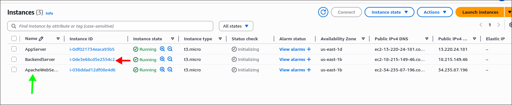
*Two EC2 instances deployed on AWS - one for Spring backend and one for Apache frontend*

### Components:

1. **Spring Boot Backend (Server 1)**
   - RESTful API server running on HTTPS (port 6500)
   - Handles authentication and business logic
   - Deployed in Docker container
   - Uses TLS/SSL certificates for secure communication

2. **Apache Frontend (Server 2)**
   - Serves static HTML/JavaScript client
   - Provides user interface for authentication
   - Makes secure HTTPS requests to backend API
   - Delivers client-side code over encrypted channels

3. **Communication Flow**
   ```
   User Browser → Apache Server (HTTPS) → JavaScript Client
                                              ↓
   User Browser ← Token Response ← Spring Backend (HTTPS)
   ```

## Key Security Features

### 🔐 TLS/SSL Encryption
- **Server-side**: PKCS12 keystore with custom certificates
- **Protocol**: HTTPS for all communications
- **Certificate Management**: Let's Encrypt integration for production
- **Configuration**: Both servers configured with proper TLS certificates

### 🔑 Authentication & Authorization
- **Token-based Authentication**: UUID tokens generated upon successful login
- **Bearer Token Authorization**: Protected endpoints require valid Authorization header
- **Session Management**: Secure token storage and validation

### 🛡️ Password Security
- **Hashing Algorithm**: Bcrypt with cost factor 12 (4096 iterations)
- **Salted Hashing**: Automatic salt generation for each password
- **Secure Storage**: Passwords never stored in plain text
- **Verification**: Secure password comparison without exposing hashes

### 🌐 CORS Configuration
- Cross-Origin Resource Sharing enabled for frontend-backend communication
- Configured to support credentials and custom headers
- Allows secure cross-origin requests

## Getting Started

### Prerequisites

Before you begin, ensure you have the following installed:

```bash
# Java Development Kit 17 or higher
java -version
# Output: java version "17.0.x" or higher

# Apache Maven 3.6+ (or use included Maven wrapper)
mvn -version

# Docker (for containerization)
docker --version

# Git (for cloning the repository)
git --version
```

### Installation

1. **Clone the repository**

```bash
git clone https://github.com/yourusername/SpringSecurityEC2.git
cd SpringSecurityEC2
```

2. **Build the project using Maven**

```bash
# Using Maven wrapper (recommended)
./mvnw clean package

# Or using system Maven
mvn clean package
```

3. **Verify the build**

```bash
# The JAR file should be created in target/ directory
ls -l target/SpringSecurityEC2-0.0.1-SNAPSHOT.jar
```

## Deployment

### Backend Spring Server Setup

#### Step 1: Launch AWS EC2 Instance

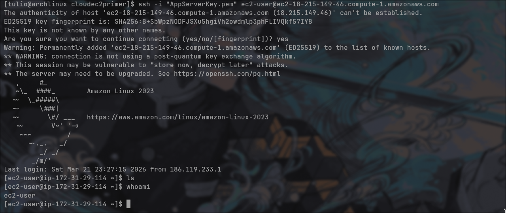
*AWS EC2 instance configuration for Spring backend*

- Launch an Amazon Linux 2023 instance
- Configure security group to allow inbound traffic on port 6500 (HTTPS)
- Ensure instance has sufficient resources (t2.medium or higher recommended)

#### Step 2: Install Docker

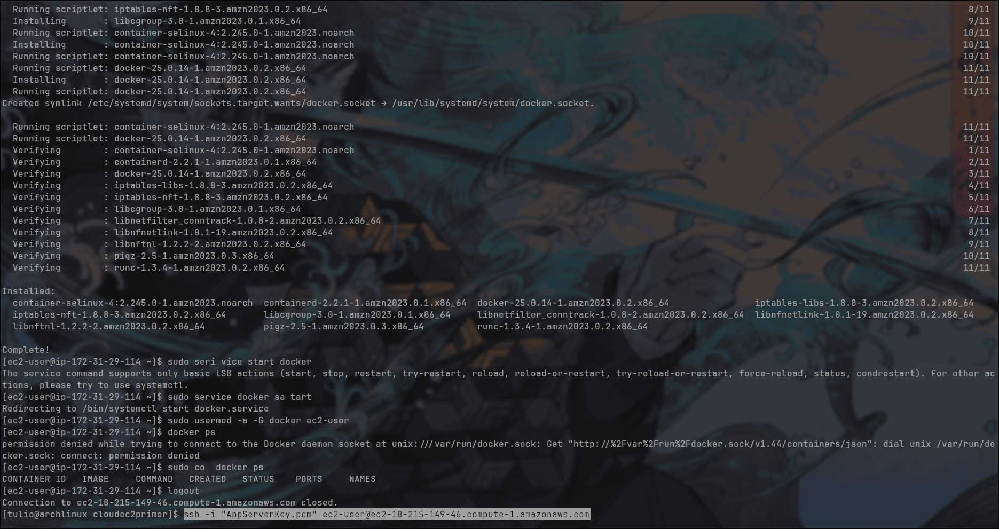
*Docker installation on EC2 instance*

```bash
# Update system packages
sudo yum update -y

# Install Docker
sudo yum install docker -y

# Start Docker service
sudo systemctl start docker
sudo systemctl enable docker

# Add user to docker group
sudo usermod -aG docker ec2-user

# Verify Docker installation
docker --version
```

#### Step 3: Build Docker Image

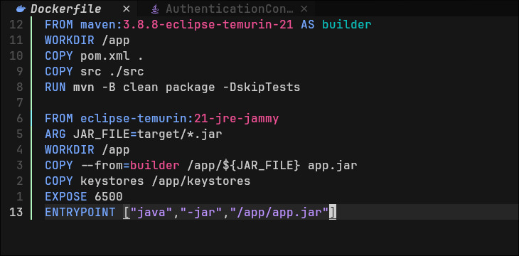
*Building the Docker image from Dockerfile*

```bash
# Build the Docker image
docker build -t spring-security-backend .

# Verify image was created
docker images
```

The Dockerfile uses a multi-stage build:
- **Stage 1**: Maven build with Java 21
- **Stage 2**: Runtime with Eclipse Temurin JRE 21

#### Step 4: Tag and Push to Docker Hub

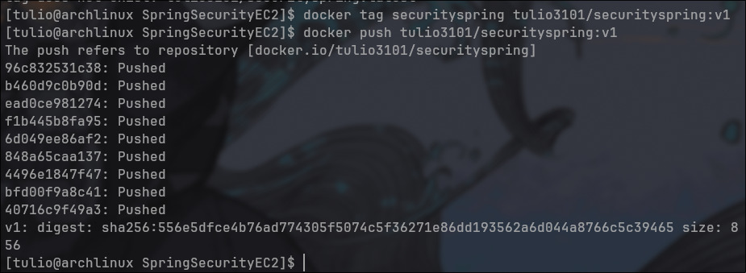
*Tagging Docker image for Docker Hub*

```bash
# Tag the image
docker tag spring-security-backend:latest yourusername/spring-security-backend:latest

# Login to Docker Hub
docker login

# Push to Docker Hub
docker push yourusername/spring-security-backend:latest
```

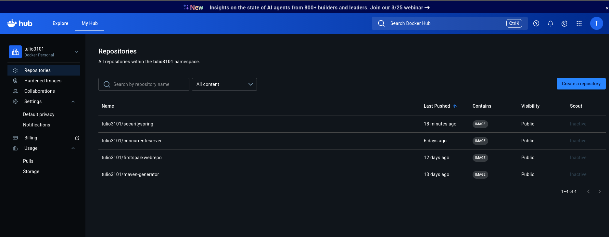
*Docker image published to Docker Hub*

#### Step 5: Run the Container

```bash
# Pull the image (if using Docker Hub)
docker pull yourusername/spring-security-backend:latest

# Run the container
docker run -d \
  -p 6500:6500 \
  --name spring-backend \
  --restart unless-stopped \
  spring-security-backend:latest

# Verify container is running
docker ps

# Check logs
docker logs spring-backend
```

#### Step 6: Verify HTTPS Endpoint

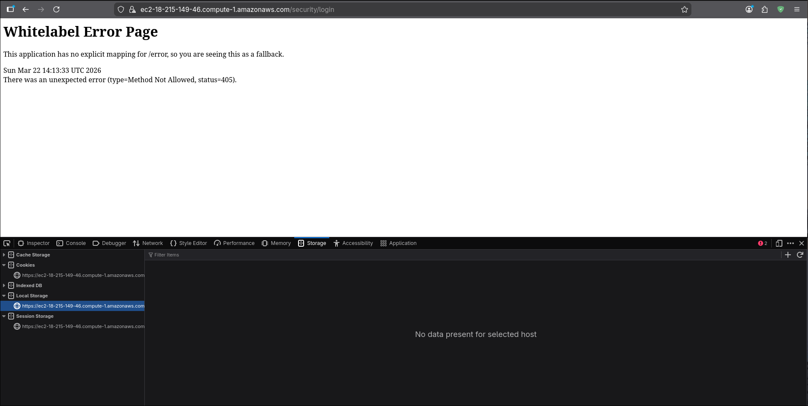
*Accessing the Spring backend via HTTPS*

Access your backend at: `https://your-ec2-instance-ip:6500/security/login`

### Frontend Apache Server Setup

#### Step 1: Launch Second EC2 Instance

- Launch another Amazon Linux 2023 instance for Apache
- Configure security group to allow HTTP (80) and HTTPS (443)
- Ensure proper DNS configuration or elastic IP

#### Step 2: Install Apache HTTP Server

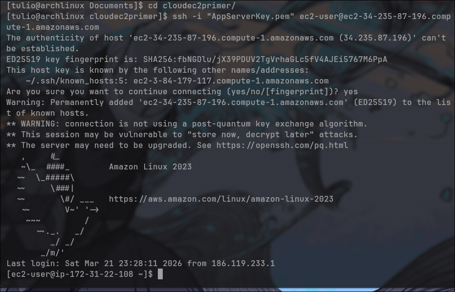
*Apache HTTP Server installation and configuration*

```bash
# Update system
sudo yum update -y

# Install Apache
sudo yum install httpd -y

# Install mod_ssl for HTTPS
sudo yum install mod_ssl -y

# Start Apache service
sudo systemctl start httpd
sudo systemctl enable httpd

# Verify Apache is running
sudo systemctl status httpd
```

#### Step 3: Configure TLS/SSL for Apache

```bash
# Install Certbot for Let's Encrypt
sudo yum install certbot python3-certbot-apache -y

# Obtain SSL certificate (replace with your domain)
sudo certbot --apache -d yourdomain.com

# Certbot will automatically configure Apache for HTTPS
```

#### Step 4: Deploy Frontend Files

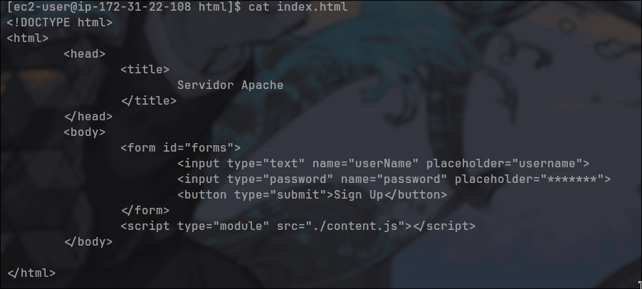
*HTML client interface served by Apache*

```bash
# Navigate to web root
cd /var/www/html

# Create your index.html and JavaScript files
sudo vim index.html
sudo vim script.js
```

Example `index.html`:
```html
<!DOCTYPE html>
<html lang="en">
<head>
    <meta charset="UTF-8">
    <meta name="viewport" content="width=device-width, initial-scale=1.0">
    <title>Secure Login</title>
    <link rel="stylesheet" href="styles.css">
</head>
<body>
    <div class="login-container">
        <h1>Secure Authentication</h1>
        <form id="loginForm">
            <input type="text" id="username" placeholder="Username" required>
            <input type="password" id="password" placeholder="Password" required>
            <button type="submit">Login</button>
        </form>
        <div id="message"></div>
    </div>
    <script src="script.js"></script>
</body>
</html>
```

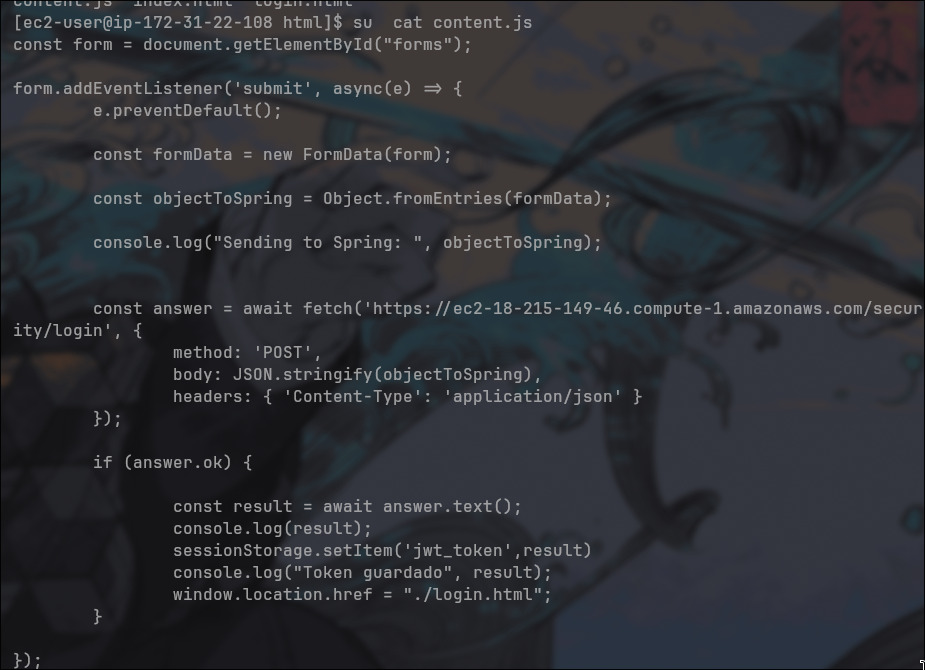
*Async JavaScript code for secure API communication*

Example `script.js`:
```javascript
const API_URL = 'https://your-backend-url:6500/security';

document.getElementById('loginForm').addEventListener('submit', async (e) => {
    e.preventDefault();
    
    const username = document.getElementById('username').value;
    const password = document.getElementById('password').value;
    
    try {
        const response = await fetch(`${API_URL}/login`, {
            method: 'POST',
            headers: {
                'Content-Type': 'application/json'
            },
            body: JSON.stringify({ username, password })
        });
        
        if (response.ok) {
            const data = await response.json();
            localStorage.setItem('authToken', data.token);
            document.getElementById('message').textContent = 'Login successful!';
            document.getElementById('message').style.color = 'green';
        } else {
            document.getElementById('message').textContent = 'Login failed!';
            document.getElementById('message').style.color = 'red';
        }
    } catch (error) {
        console.error('Error:', error);
        document.getElementById('message').textContent = 'Connection error!';
        document.getElementById('message').style.color = 'red';
    }
});
```

#### Step 5: Verify Frontend Deployment

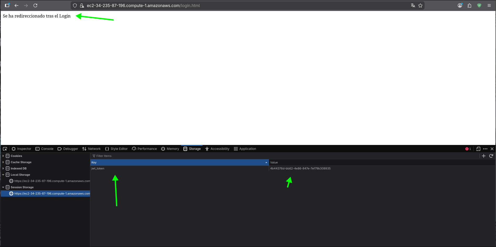
*Authentication interface served by Apache*

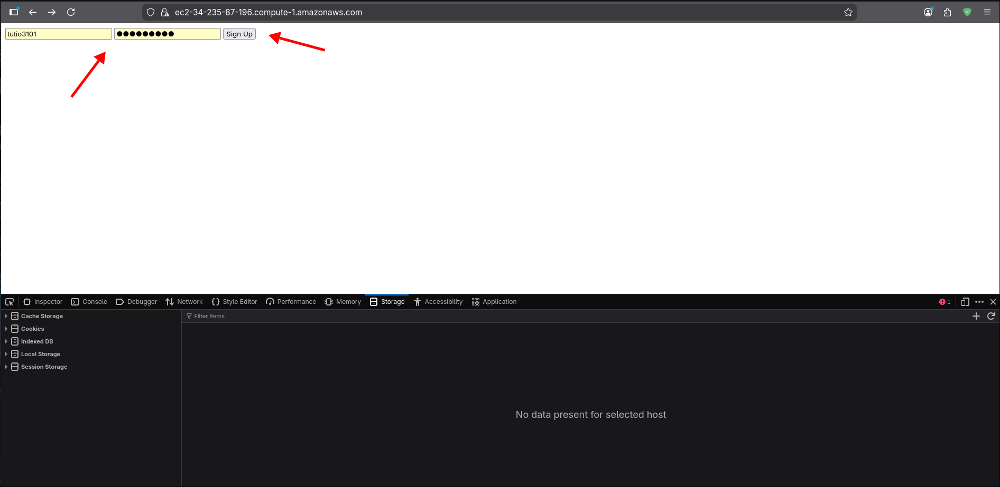
*Login form with secure authentication flow*

Access your frontend at: `https://yourdomain.com`

## Running the Application

### Local Development

1. **Run Spring Boot application locally**

```bash
# Using Maven wrapper
./mvnw spring-boot:run

# Or using the JAR file
java -jar target/SpringSecurityEC2-0.0.1-SNAPSHOT.jar
```

2. **Access the application**

```
HTTPS Backend: https://localhost:6500
```

### Production Deployment

1. **Backend**: Access via HTTPS on port 6500
   - Example: `https://your-backend-domain.com:6500`

2. **Frontend**: Access via HTTPS on port 443
   - Example: `https://your-frontend-domain.com`

### Security Testing

- **TLS/SSL Verification**: Use `openssl s_client -connect localhost:6500`
- **Password Hashing**: Verify Bcrypt implementation with cost factor 12
- **Token Validation**: Test with invalid/expired tokens
- **CORS**: Test cross-origin requests from different domains

## Built With

### Backend Technologies
- **[Spring Boot 4.0.3](https://spring.io/projects/spring-boot)** - Application framework
- **[Spring Web MVC](https://docs.spring.io/spring-framework/reference/web/webmvc.html)** - RESTful web services
- **[Password4j 1.6.1](https://password4j.com/)** - Password hashing library (Bcrypt)
- **[Maven](https://maven.apache.org/)** - Dependency management and build tool

### Frontend Technologies
- **[Apache HTTP Server](https://httpd.apache.org/)** - Web server
- **HTML5** - Client interface structure
- **JavaScript (ES6+)** - Async API communication

### Infrastructure & DevOps
- **[AWS EC2](https://aws.amazon.com/ec2/)** - Cloud computing instances
- **[Docker](https://www.docker.com/)** - Containerization platform
- **[Let's Encrypt](https://letsencrypt.org/)** - SSL/TLS certificates
- **[Eclipse Temurin](https://adoptium.net/)** - OpenJDK distribution (Java 17/21)

### Security Tools
- **TLS/SSL** - Transport Layer Security
- **Bcrypt** - Password hashing algorithm
- **UUID** - Token generation
- **PKCS12** - Keystore format

## Project Structure

```
SpringSecurityEC2/
├── src/
│   ├── main/
│   │   ├── java/tdse/servidor/security/
│   │   │   ├── Application.java                 # Main Spring Boot application
│   │   │   ├── AuthenticationController.java    # REST API endpoints
│   │   │   ├── User.java                        # User domain model
│   │   │   ├── LoginDTO.java                    # Login data transfer object
│   │   │   ├── PasswordDTO.java                 # Password verification DTO
│   │   │   ├── InvalidTokenException.java       # Custom exception
│   │   │   ├── SecureUrlReader.java             # TLS configuration utility
│   │   │   └── config/
│   │   │       └── CorsConfig.java              # CORS configuration
│   │   └── resources/
│   │       └── application.properties           # Spring configuration
│   └── test/
│       └── java/tdse/servidor/security/SprintSecurityEC2/
│           └── ApplicationTests.java            # Test suite
├── keystores/
│   └── ecikeystore.p12                          # PKCS12 keystore for TLS
├── docs/
│   └── images/                                  # Documentation screenshots
├── Dockerfile                                   # Multi-stage Docker build
├── pom.xml                                      # Maven project configuration
├── mvnw, mvnw.cmd                              # Maven wrapper scripts
├── README.md                                    # This file
├── LICENSE                                      # MIT License
└── .gitignore                                   # Git ignore configuration
```

## License

This project is licensed under the MIT License.


## Author

**Tulio Riaño Sánchez**


## Acknowledgments

- **Spring Boot Team** - For the excellent framework and documentation
- **Password4j Contributors** - For providing a robust password hashing library
- **AWS Documentation** - For comprehensive EC2 and security best practices guides
- **Let's Encrypt** - For free SSL/TLS certificates
- **Professor/Instructor Name** - For guidance on enterprise architecture design
- **OWASP** - For security best practices and guidelines
- **The Spring Security Community** - For security patterns and examples

---

## Additional Resources

- [Spring Boot Security Documentation](https://docs.spring.io/spring-boot/docs/current/reference/html/web.html#web.security)
- [AWS EC2 LAMP Tutorial](https://docs.aws.amazon.com/linux/al2023/ug/ec2-lamp-amazon-linux-2023.html)
- [OWASP Password Storage Cheat Sheet](https://cheatsheetseries.owasp.org/cheatsheets/Password_Storage_Cheat_Sheet.html)
- [Let's Encrypt Documentation](https://letsencrypt.org/docs/)
- [Docker Best Practices](https://docs.docker.com/develop/dev-best-practices/)

---